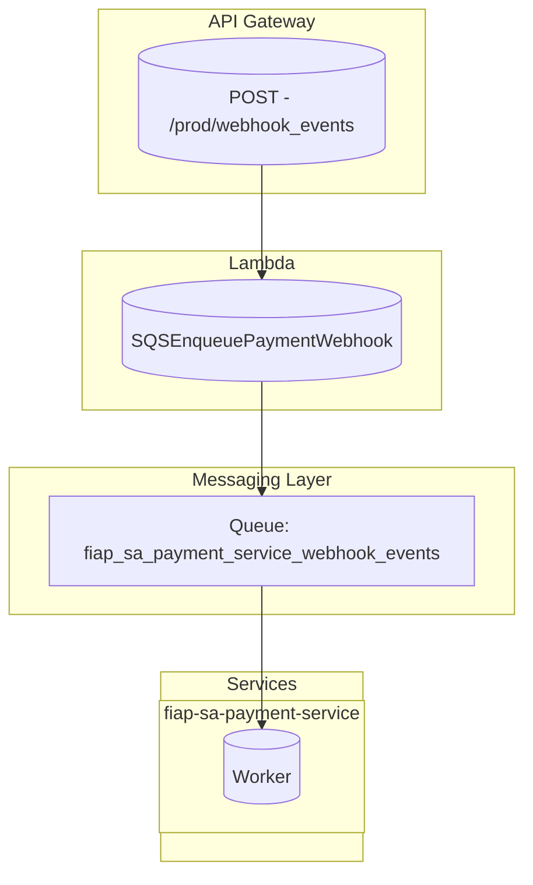

# FiAP SA Serverless Architecture

## 🌐 Represetação da comunicação entre os serviços

Abaixo está o diagrama representando a comunicação entre os principais componentes da arquitetura (Lambda, API Gateway e SQS).



Este repositório descreve a infraestrutura e o código da função **Lambda** responsável por processar eventos de Webhook no serviço de pagamentos, com integração ao **API Gateway** e filas **SQS** para orquestração de mensagens. A infraestrutura é gerida com **Terraform** e a função Lambda é escrita em [GO](./SQSEnqueuePaymentWebhook/main.go).

## 📦 Arquitetura

A arquitetura é composta por vários componentes importantes:

- **AWS Lambda**: A função Lambda processa eventos recebidos via **API Gateway** e publica dados em uma fila **SQS**.
- **API Gateway**: Expõe uma rota `POST /prod/webhook_events` que recebe eventos e invoca a função Lambda.
- **SQS (Simple Queue Service)**: Utilizado para armazenar e processar eventos de webhook e mensagens de eventos de pagamento.
- **IAM**: Role do IAM é utilizada para conceder permissões apropriadas à função Lambda.

## 📁 Estrutura do Projeto

A estrutura de diretórios do projeto é a seguinte:

```
├── production/terraform/              # Infraestrutura gerida pelo Terraform
│   ├── ...
│   ├── main.go                        # Código da função Lambda
│   ├── deployment.zip                 # Pacote ZIP para deploy
├── test/                              # Scripts de teste
│   └── test-webhook.sh                # Script para testar a API de Webhook
├── Makefile                           # Arquivo de automação para build e deploy
```

## ☁️ Infraestrutura de Produção

A infraestrutura é configurada com **Terraform** e inclui os seguintes recursos:

1. **AWS Lambda**:
   - Função Lambda para processar os eventos do Webhook.
   - Integração com o **API Gateway** para exposição da API.
   - Publicação de eventos para a fila **SQS**.
   
2. **API Gateway**:
   - Rota `POST /webhook_events` exposta para o recebimento de eventos de pagamento.

3. **SQS (Simple Queue Service)**:
   - **SQS Payment Webhook Events**: Fila onde os eventos de Webhook serão enviados.

4. **IAM Role**:
   - Permite que a Lambda acesse recursos como SQS e o API Gateway.

> 🛑 **Importante:**  
> O Terraform **não é executado localmente**.  
> Todos os planos e execuções (`apply`) são realizados via **Terraform Cloud**, acionados através de **pipelines CI/CD** (GitHub Actions).

## Funcionalidade

### Webhook de Pagamento

A função Lambda é acionada por eventos recebidos via **API Gateway**. Esses eventos são processados e publicados na fila **SQS** para serem consumidos posteriormente.

### Testes

O script `test/test-webhook.sh` é utilizado para testar os cenários do webhook. Ele realiza chamadas para o endpoint do **API Gateway** para garantir que o fluxo de integração funcione corretamente.

### Makefile

O **Makefile** é utilizado para automatizar o processo de build, zipagem e execução de testes da função Lambda.

#### Comandos:

- `make build-webhook`: Compila a função Lambda para o ambiente Linux.
- `make zip-webhook`: Empacota a função Lambda em um arquivo `.zip` para deploy.
- `make test-prod`: Executa os testes, aceitando parâmetros como o endpoint do webhook a ser testado.

## Como Usar

### Pré-requisitos

- **Go**: Para compilar a função Lambda.
- **Make**: Para automação das tarefas.

### Passos para Deploy

1. Navegue até o diretório `production/terraform/`.
2. Execute `terraform init` para inicializar o projeto Terraform.
3. Execute `terraform apply` para provisionar a infraestrutura na AWS.

### Deploy da Função Lambda

1. Navegue até o diretório `SQSEnqueuePaymentWebhook/`.
2. Compile a função Lambda utilizando o comando:

    ```bash
    make build-webhook
    ```

3. Faça o deploy da função Lambda criando o pacote `.zip`:

    ```bash
    make zip-webhook
    ```

### Testando o Webhook

1. Navegue até o diretório `test/`.
2. Execute o script `test-webhook.sh` para testar a API de webhook or using `make test-prod`:

    ```bash
    ./test/test-webhook.sh <webhook_url>
    ```
